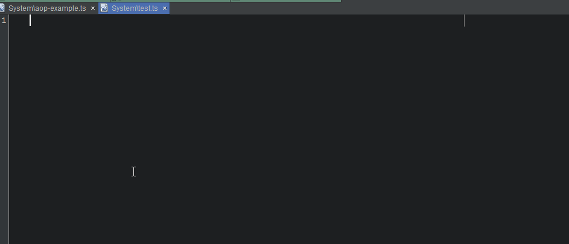
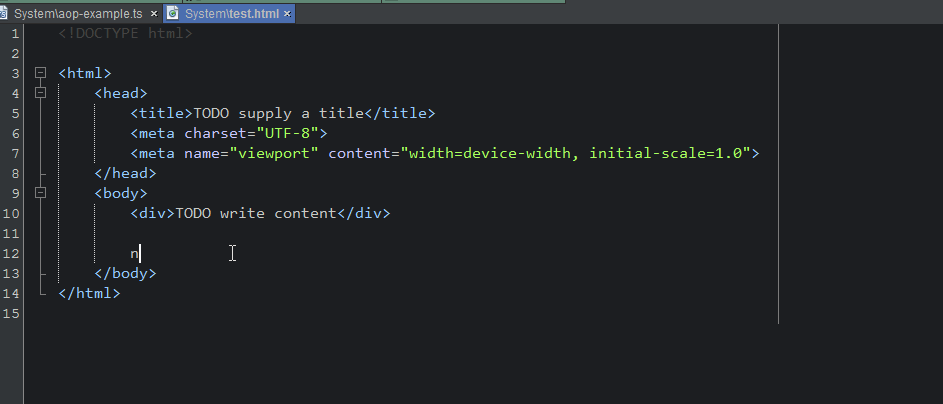

<h1>Angular TypeScript Snippets for NetBeans</h1>
<h3>Now Updated for Angular 4.3.0 release</h3>

It is based on the Visual Studio Code implementation: <a href="https://github.com/johnpapa/vscode-angular2-snippets">https://github.com/johnpapa/vscode-angular2-snippets</a>
This extension for NetBeans adds snippets for Angular for TypeScript and HTML.

<h3>TypeScript</h3>

<h3>HTML</h3>

<h2>Usage</h2>
Type part of a snippet, press <strong>enter</strong> or <strong>tab</strong>, and the snippet unfolds.

<h3>TypeScript Angular Snippets</h3>
<ol>
    <li><strong>aComponent</strong> - component</li>
    <li><strong>aComponentInline</strong> - component with inline template</li>
    <li><strong>aComponentRoot</strong> - root app component</li>
    <li><strong>aDirective</strong> - directive</li>
    <li><strong>aGuardCanActive</strong> - <code>CanActivate</code> guard</li>
    <li><strong>aGuardCanActiveChild</strong> - <code>CanActivateChild</code> guard</li>
    <li><strong>aGuardCanDeactivate</strong> - <code>CanDeactivate</code> guard</li>
    <li><strong>aHttpGet</strong> - <code>http.get</code> with Rx Observable</li>
    <li><strong>aHttpclientGet</strong> - <code>httpClient.get</code> with Rx Observable</li>
    <li><strong>aHttpInterceptor</strong> - Empty Angular <code>HttpInterceptor</code> for <code>HttpClient</code></li>
    <li><strong>aHttpInterceptorHeaders</strong> - Angular <code>HttpInterceptor</code> that sets headers for <code>HttpClient</code></li>
    <li><strong>aHttpInterceptorLogging</strong> - Angular <code>HttpInterceptor</code> that logs traffic for <code>HttpClient</code></li>
    <li><strong>aModule</strong> - module</li>
    <li><strong>aModuleRoot</strong> - root app module</li>
    <li><strong>aModuleRouting</strong> - routing module file (forChild)</li>
    <li><strong>aOutputEvent</strong> - <code>@Output</code> event and emitter</li>
    <li><strong>aPipe</strong> - pipe</li>
    <li><strong>aRoutePath404</strong> - 404 route path</li>
    <li><strong>aRoutePathDefault</strong> - default route path</li>
    <li><strong>aRoutePathEager</strong> - eager route path</li>
    <li><strong>aRoutePathLazy</strong> - lazy route path</li>
    <li><strong>aRouterEvents</strong> - listen to one or more router events</li>
    <li><strong>aService</strong> - service</li>
    <li><strong>aServiceHttp</strong> - service with <code>Http</code></li>
    <li><strong>aServiceHttpclient</strong> - service with <code>HttpClient</code></li>
    <li><strong>aCtorSkipSelf</strong> - angular <code>NgModule</code>'s <code>skipself</code> constructor</li>
    <li><strong>aSubscribe</strong> - Rx Observable subscription</li>
    <li><strong>aResolver</strong> - resolver</li>
</ol>

<h3>TypeScript RxJS Snippets</h3>
<ul>
    <li><strong>rxObservable</strong> - Rx <strong>Observale</strong> import</li>
    <li><strong>rxSubject</strong> - Rx <strong>Subject</strong> import</li>
    <li><strong>rxReplaySubject</strong> - Rx <strong>ReplaySubject</strong> import</li>
    <li><strong>rxBehaviorSubject</strong> - Rx <strong>BehaviorSubject</strong> import</li>
    <li><strong>rxAddOperator</strong> - Rx add operator import</li>
    <li><strong>rxAddObservable</strong> - Rx add observale import</li>
</ul>

<h3>HTML Snippets</h3>
<ul>
    <li><strong>aClass</strong> - <code>[class]</code> binding</li>
    <li><strong>aNgClass</strong> - <code>ngClass</code></li>
    <li><strong>aNgContainer</strong> - <code>&lt;ng-container&gt;</code> element</li>
    <li><strong>aNgContent</strong> - <code>&lt;ng-content&gt;</code> element</li>
    <li><strong>aNgFor</strong> - <code>*ngFor</code></li>
    <li><strong>aNgForAsync</strong> - <code>*ngFor</code> with async</li>
    <li><strong>aNgForTrackBy</strong> - <code>*ngFor</code> with trackBy</li>
    <li><strong>aNgIf</strong> - <code>*ngIf</code></li>
    <li><strong>aNgIfElse</strong> - <code>*ngIf</code> with <code>else</code></li>
    <li><strong>aNgModel</strong> - <code>ngModel</code></li>
    <li><strong>aNgStyle</strong> - <code>ngStyle</code></li>
    <li><strong>aNgSwitch</strong> - <code>ngSwitch</code></li>
    <li><strong>aNgTemplate</strong> - <code>&lt;ng-template&gt;</code> element</li>
    <li><strong>aPrej</strong> - show the JSON form of a model</li>
    <li><strong>aPreja</strong> - show the JSON form of a model, using async</li>
    <li><strong>aRouterLink</strong> - <code>routerLink</code></li>
    <li><strong>aRouterLinkParam</strong> - <code>routerLink</code> with a route parameter</li>
    <li><strong>aSelect</strong> - <code>&lt;select&gt;</code> control</li>
    <li><strong>aStyle</strong> - <code>[style]</code> binding</li>
</ul>

<h2>How to install</h2>

Install the plugin.

Test it into a TypeScript or HTML file (Examples: typescript shortcut <strong>aPipe</strong> + TAB => import { Pipe, PipeTransform..., html shortcut <strong>aNgSwitch</strong> + TAB => &lt;div [ngSwitch]=...", ...)

<h2>Known Bugs</h2>
HTML code completion doesn't include the code templates, but the code templates are working well. A Ticket was created: https://netbeans.org/bugzilla/show_bug.cgi?id=250321
